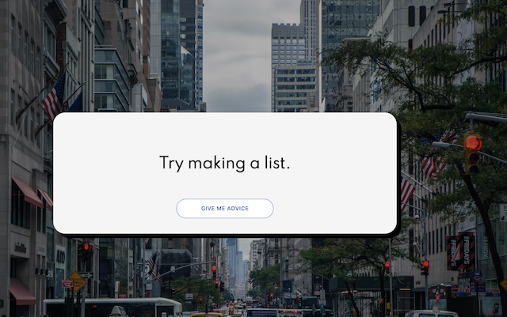

# Advice App
  
ReactJS API data fetching project. Button click fetches quaint advice. 


### Installing

```
 
clone https://github.com/BFronz/advice-app.git

npm install package.json

Run  npm start

```

## Built With
* React.js
* API data fetching 
* Node.js


## Features

Runs on heroku.com: https://nameless-sierra-08130.herokuapp.com/





## Credits
JavaScript Mastery:  <a href="https://www.youtube.com/channel/UCmXmlB4-HJytD7wek0Uo97A" target="_blank">JavaScript Mastery</a>

api.adviceslip.com
